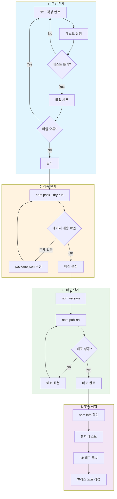
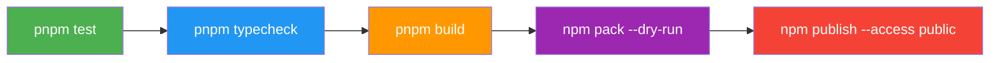
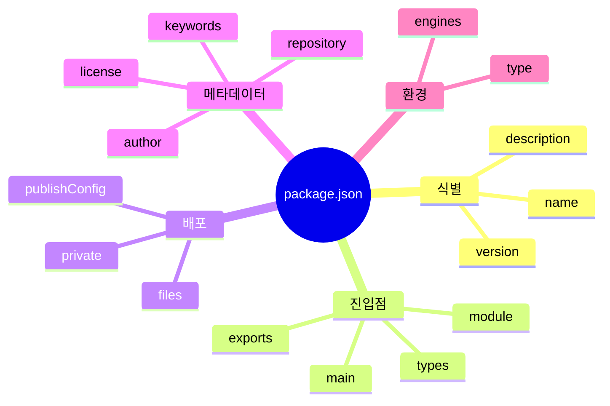
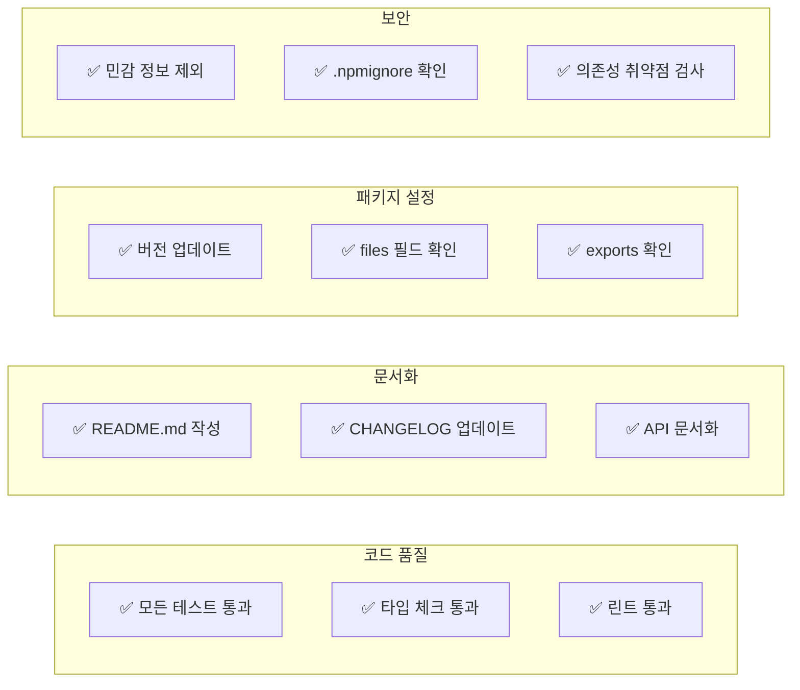
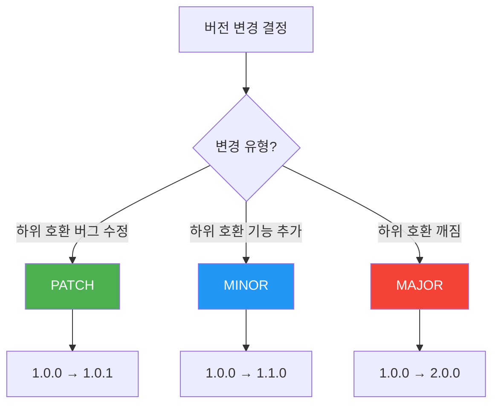
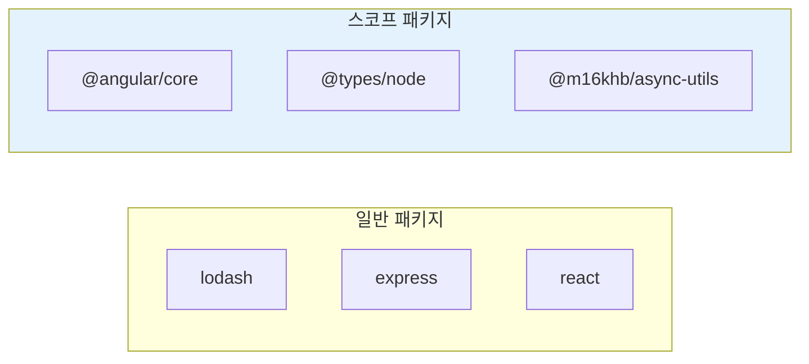
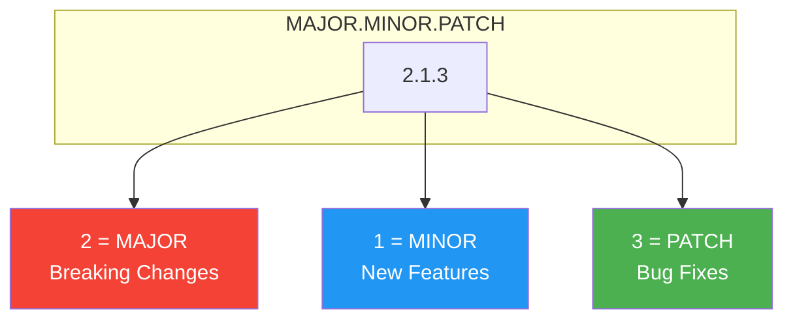
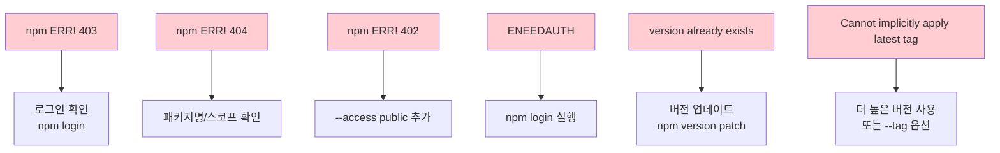
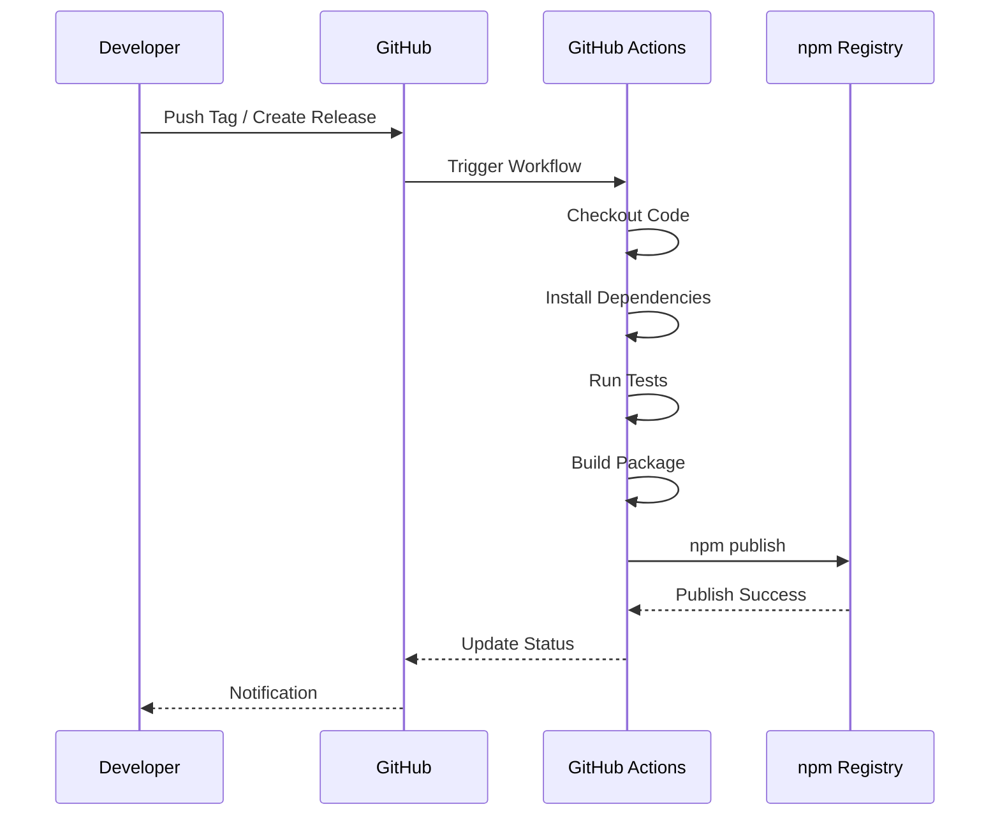
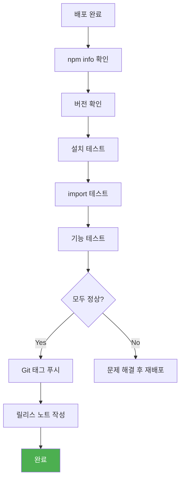

# npm 패키지 배포 가이드

> `@m16khb/async-utils` 패키지를 npm 레지스트리에 배포하는 완벽 가이드

---

## 목차

1. [개요](#1-개요)
2. [배포 워크플로우](#2-배포-워크플로우)
3. [사전 준비](#3-사전-준비)
   - [npm 계정 설정](#31-npm-계정-설정)
   - [패키지 설정 확인](#32-패키지-설정-확인)
4. [배포 전 체크리스트](#4-배포-전-체크리스트)
5. [배포 프로세스](#5-배포-프로세스)
   - [Step 1: 코드 검증](#step-1-코드-검증)
   - [Step 2: 버전 관리](#step-2-버전-관리)
   - [Step 3: 패키지 검증](#step-3-패키지-검증)
   - [Step 4: 배포 실행](#step-4-배포-실행)
6. [스코프 패키지 배포](#6-스코프-패키지-배포)
7. [버전 관리 전략](#7-버전-관리-전략)
8. [트러블슈팅](#8-트러블슈팅)
9. [CI/CD 자동화](#9-cicd-자동화)
10. [배포 후 검증](#10-배포-후-검증)

---

## 1. 개요

이 문서는 npm 패키지 배포의 전체 과정을 설명합니다. 모노레포 환경에서 개별 패키지를 안전하고 효율적으로 배포하는 방법을 다룹니다.

### 패키지 정보

| 항목 | 값 |
|------|-----|
| 패키지명 | `@m16khb/async-utils` |
| 타입 | 스코프 패키지 (Scoped Package) |
| 접근성 | Public |
| 모듈 형식 | ESM (ES Modules) |
| 런타임 | Node.js 20+ |

---

## 2. 배포 워크플로우

### 전체 흐름도



### 간단 명령어 흐름



---

## 3. 사전 준비

### 3.1 npm 계정 설정

#### npm 계정 생성

1. [npmjs.com/signup](https://www.npmjs.com/signup) 에서 계정 생성
2. 이메일 인증 완료
3. 2FA(이중 인증) 활성화 권장

#### 로컬 로그인

```bash
# npm 로그인
npm login

# 로그인 확인
npm whoami
# 출력: m16khb
```

#### 2FA 설정 (권장)

```bash
# 프로필에서 2FA 활성화
# https://www.npmjs.com/settings/m16khb/tokens

# OTP 인증 방식
# - Authenticator App (권장)
# - Security Key
```

### 3.2 패키지 설정 확인

#### package.json 필수 필드

```json
{
  "name": "@m16khb/async-utils",
  "version": "1.0.0",
  "description": "비동기 작업 제어 라이브러리",
  "main": "./dist/index.js",
  "module": "./dist/index.js",
  "types": "./dist/index.d.ts",
  "type": "module",
  "files": ["dist"],
  "publishConfig": {
    "access": "public"
  },
  "repository": {
    "type": "git",
    "url": "https://github.com/m16khb/async-utils.git"
  },
  "keywords": ["async", "retry", "timeout", "concurrency"],
  "author": "m16khb",
  "license": "MIT",
  "engines": {
    "node": ">=20.0.0"
  }
}
```

#### 필드 설명



| 필드 | 필수 | 설명 |
|------|:----:|------|
| `name` | ✅ | 패키지 이름 (스코프 포함) |
| `version` | ✅ | 시맨틱 버전 |
| `main` | ✅ | CommonJS 진입점 |
| `module` | ⭕ | ESM 진입점 |
| `types` | ⭕ | TypeScript 타입 정의 |
| `files` | ✅ | 배포에 포함할 파일 |
| `publishConfig` | ⭕ | 배포 설정 (스코프 패키지 필수) |
| `repository` | ⭕ | 소스 코드 저장소 |
| `license` | ✅ | 라이선스 |

---

## 4. 배포 전 체크리스트



### 체크리스트 명령어

```bash
# 1. 테스트
pnpm test

# 2. 타입 체크
pnpm typecheck

# 3. 빌드
pnpm build

# 4. 패키지 내용 미리보기
npm pack --dry-run

# 5. 의존성 취약점 검사
npm audit
```

---

## 5. 배포 프로세스

### Step 1: 코드 검증

```bash
# 패키지 디렉토리로 이동 (중요!)
cd /Users/m16khb/Workspace/npm-library/packages/async-utils

# 테스트 실행
pnpm test

# 타입 체크
pnpm typecheck

# 빌드
pnpm build
```

**예상 출력:**

```
 Test Files  9 passed (9)
      Tests  153 passed (153)

> tsc --noEmit
(타입 오류 없음)

ESM ⚡️ Build success in 6ms
DTS ⚡️ Build success in 521ms
```

### Step 2: 버전 관리

#### 시맨틱 버전 규칙



#### 버전 업데이트 명령어

```bash
# 패치 버전 (버그 수정): 1.0.0 → 1.0.1
npm version patch

# 마이너 버전 (기능 추가): 1.0.0 → 1.1.0
npm version minor

# 메이저 버전 (Breaking Change): 1.0.0 → 2.0.0
npm version major

# 특정 버전으로 설정
npm version 1.2.3

# 프리릴리스 버전
npm version prerelease --preid=beta  # 1.0.0 → 1.0.1-beta.0
```

### Step 3: 패키지 검증

```bash
# 패키지 내용 미리보기 (실제 배포하지 않음)
npm pack --dry-run
```

**예상 출력:**

```
npm notice 📦  @m16khb/async-utils@1.0.0
npm notice Tarball Contents
npm notice 11.2kB README.md
npm notice 4.7kB  dist/core/concurrency/index.d.ts
npm notice 213B   dist/core/concurrency/index.js
...
npm notice Tarball Details
npm notice name:          @m16khb/async-utils
npm notice version:       1.0.0
npm notice package size:  9.2 kB
npm notice unpacked size: 33.5 kB
npm notice total files:   20
```

#### 확인 사항

| 항목 | 확인 내용 |
|------|----------|
| 파일 목록 | `dist/` 폴더만 포함되어야 함 |
| 패키지 크기 | 예상 범위 내인지 확인 |
| 민감 정보 | `.env`, 설정 파일 등 제외 확인 |
| 버전 | 의도한 버전인지 확인 |

### Step 4: 배포 실행

```bash
# 스코프 패키지 배포 (public 접근)
npm publish --access public
```

**2FA 활성화 시:**

```
npm notice Publishing to https://registry.npmjs.org/
This operation requires a one-time password.
Enter OTP: xxxxxx
+ @m16khb/async-utils@1.0.0
```

---

## 6. 스코프 패키지 배포

### 스코프 패키지란?



| 구분 | 일반 패키지 | 스코프 패키지 |
|------|-----------|-------------|
| 형식 | `package-name` | `@scope/package-name` |
| 기본 접근성 | Public | Private |
| 네임스페이스 | 전역 | 스코프 내 |
| 예시 | `lodash` | `@m16khb/async-utils` |

### 스코프 패키지 배포 시 주의사항

```bash
# ❌ 잘못된 방법 (기본이 private이라 실패)
npm publish

# ✅ 올바른 방법
npm publish --access public

# 또는 package.json에 설정
# "publishConfig": { "access": "public" }
```

### 스코프 생성

스코프는 npm 사용자명 또는 조직명과 일치해야 합니다:

```
npm 계정: m16khb
스코프: @m16khb
패키지: @m16khb/async-utils
```

---

## 7. 버전 관리 전략

### Semantic Versioning (SemVer)



### 버전 변경 가이드

| 변경 유형 | 버전 | 예시 |
|----------|------|------|
| 버그 수정 | PATCH | 타이머 정리 로직 수정 |
| 새 기능 (호환) | MINOR | 새로운 백오프 전략 추가 |
| API 변경 | MAJOR | 함수 시그니처 변경 |
| 초기 개발 | 0.x.x | 불안정한 API |
| 프리릴리스 | x.x.x-beta.0 | 테스트 버전 |

### Changesets를 통한 버전 관리 (모노레포)

```bash
# changeset 생성
pnpm changeset

# 버전 업데이트 및 CHANGELOG 생성
pnpm changeset version

# 배포
pnpm changeset publish
```

---

## 8. 트러블슈팅

### 일반적인 에러와 해결책



### 에러별 상세 해결

#### 1. 잘못된 디렉토리에서 배포

```
npm notice name: npm-library
npm notice version: 0.0.0
```

**원인:** 루트 디렉토리에서 `npm publish` 실행

**해결:**
```bash
# 패키지 디렉토리로 이동
cd packages/async-utils
npm publish --access public
```

#### 2. 이전 버전보다 낮은 버전

```
npm error Cannot implicitly apply the "latest" tag because
previously published version 1.1.0 is higher than the new version 1.0.0
```

**해결:**
```bash
# 더 높은 버전으로 업데이트
npm version 1.2.0
npm publish --access public

# 또는 다른 태그로 배포
npm publish --tag beta
```

#### 3. 스코프 패키지 Private 에러

```
npm ERR! 402 Payment Required
```

**해결:**
```bash
# --access public 추가
npm publish --access public

# 또는 package.json에 설정
{
  "publishConfig": {
    "access": "public"
  }
}
```

#### 4. 인증 에러

```
npm ERR! code ENEEDAUTH
```

**해결:**
```bash
# 로그인
npm login

# 토큰 확인
npm token list

# 레지스트리 확인
npm config get registry
```

---

## 9. CI/CD 자동화

### GitHub Actions 워크플로우

```yaml
# .github/workflows/publish.yml
name: Publish to npm

on:
  release:
    types: [created]

jobs:
  publish:
    runs-on: ubuntu-latest
    steps:
      - uses: actions/checkout@v4

      - name: Setup Node.js
        uses: actions/setup-node@v4
        with:
          node-version: '20'
          registry-url: 'https://registry.npmjs.org'

      - name: Setup pnpm
        uses: pnpm/action-setup@v2
        with:
          version: 9

      - name: Install dependencies
        run: pnpm install

      - name: Run tests
        run: pnpm test

      - name: Build
        run: pnpm build

      - name: Publish to npm
        run: |
          cd packages/async-utils
          npm publish --access public
        env:
          NODE_AUTH_TOKEN: ${{ secrets.NPM_TOKEN }}
```

### CI/CD 흐름도



### npm 토큰 설정

1. npm에서 토큰 생성: [npmjs.com/settings/tokens](https://www.npmjs.com/settings/tokens)
2. **Automation** 타입 선택 (CI용, 2FA 우회)
3. GitHub Secrets에 추가: `NPM_TOKEN`

---

## 10. 배포 후 검증

### 배포 확인 명령어

```bash
# npm 정보 확인
npm info @m16khb/async-utils

# 최신 버전 확인
npm view @m16khb/async-utils version

# 모든 버전 확인
npm view @m16khb/async-utils versions

# 다운로드 통계
npm view @m16khb/async-utils
```

### 설치 테스트

```bash
# 새 프로젝트에서 테스트
mkdir test-install && cd test-install
npm init -y
npm install @m16khb/async-utils

# 사용 테스트
node -e "import('@m16khb/async-utils').then(m => console.log(Object.keys(m)))"
```

### 검증 체크리스트



---

## 부록: 빠른 참조

### 필수 명령어

```bash
# 패키지 디렉토리 이동
cd packages/async-utils

# 검증
pnpm test && pnpm typecheck && pnpm build

# 패키지 미리보기
npm pack --dry-run

# 배포
npm publish --access public
```

### 버전 명령어

```bash
npm version patch   # 1.0.0 → 1.0.1
npm version minor   # 1.0.0 → 1.1.0
npm version major   # 1.0.0 → 2.0.0
```

### 유용한 링크

- [npm 문서](https://docs.npmjs.com/)
- [Semantic Versioning](https://semver.org/lang/ko/)
- [npm 패키지 페이지](https://www.npmjs.com/package/@m16khb/async-utils)

---

*마지막 업데이트: 2025-12-05*
