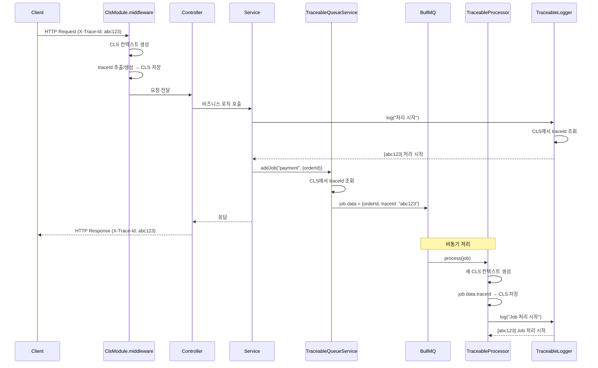
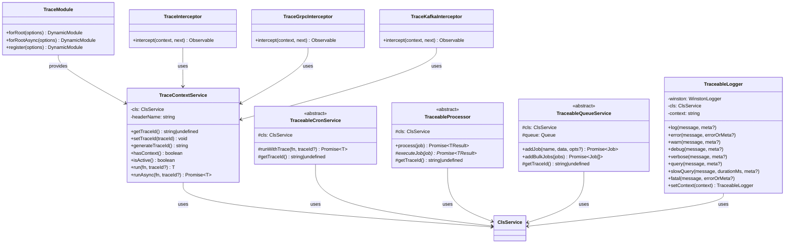
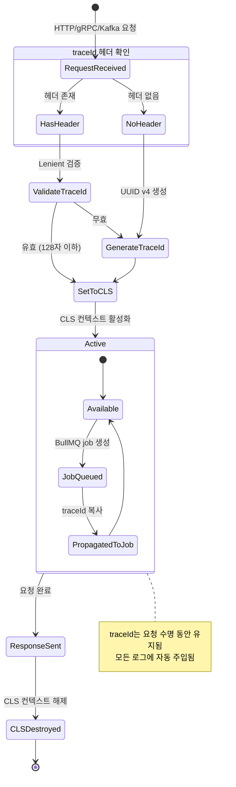

# Feature Specification: NestJS Traceable

**Feature Branch**: `003-nestjs-traceable`
**Created**: 2025-12-05
**Status**: Implemented
**Updated**: 2025-12-06 (구현 기반 전면 재작성)
**Package**: `@m16khb/nestjs-traceable`

## Overview

NestJS 애플리케이션에서 **traceId 기반 요청 추적**을 제공하는 라이브러리.
다양한 통신 채널(HTTP, gRPC, Kafka, Cron, BullMQ)을 통한 요청을 단일 traceId로 연결하여 분산 시스템의 디버깅과 모니터링을 단순화한다.

### 핵심 가치

- **단순성**: nestjs-cls 기반의 검증된 CLS 구현 활용
- **유연성**: 추상 클래스 상속 패턴으로 다양한 진입점 지원
- **통합성**: Winston 기반 로거로 traceId 자동 주입
- **실용성**: spanId 관리는 OpenTelemetry에 위임, traceId만 집중 관리

---

## Glossary (용어 정의)

| 용어 | 정의 |
|------|------|
| **traceId** | 단일 요청의 전체 수명 주기를 식별하는 고유 식별자. UUID v4 형식 (예: `abc12345-def6-7890-ghij-klmnopqrstuv`) |
| **CLS** | Continuation Local Storage. Node.js AsyncLocalStorage를 활용하여 비동기 컨텍스트 간 데이터를 전파하는 메커니즘 |
| **AsyncLocalStorage** | Node.js 내장 API. 비동기 호출 체인에서 컨텍스트를 유지하는 저장소 |
| **nestjs-cls** | NestJS용 CLS 라이브러리. AsyncLocalStorage를 NestJS 생명주기에 맞게 래핑 |
| **Interceptor** | NestJS의 AOP(관점 지향 프로그래밍) 구현체. 요청 전후로 로직을 삽입 |
| **Processor** | BullMQ의 작업 처리기. Queue에서 job을 가져와 실행하는 Worker |
| **Job** | BullMQ의 작업 단위. 데이터와 메타데이터를 포함한 비동기 작업 |
| **Metadata (gRPC)** | gRPC 요청/응답에 첨부되는 키-값 쌍. HTTP 헤더와 유사한 역할 |
| **Header (Kafka)** | Kafka 메시지에 첨부되는 메타데이터. 메시지 내용과 별개로 전송 |
| **Silent Continue** | 오류 발생 시 서비스 가용성을 우선하여 추적 없이 요청 처리를 계속하는 정책 |
| **Lenient Validation** | 엄격하지 않은 검증 정책. 비어있지 않고 128자 이하면 유효한 traceId로 허용 |

---

## Architecture

### 설계 원칙

1. **nestjs-cls 기반**: Node.js AsyncLocalStorage를 래핑한 nestjs-cls를 CLS 구현으로 사용
2. **traceId 전용**: spanId/parentSpanId는 OpenTelemetry에 위임, 본 라이브러리는 traceId만 관리
3. **추상 클래스 패턴**: 상속을 통한 보일러플레이트 제거
4. **선택적 의존성**: 사용하는 기능에 따라 필요한 패키지만 설치

### 컴포넌트 구조

```
@m16khb/nestjs-traceable
├── TraceModule              # 핵심 모듈 (ClsModule 래핑)
├── TraceContextService      # traceId 접근 API
├── Abstracts/
│   ├── TraceableCronService    # Cron 서비스 추상 클래스
│   ├── TraceableProcessor      # BullMQ Processor 추상 클래스
│   └── TraceableQueueService   # Queue 서비스 추상 클래스
├── Interceptors/
│   ├── TraceInterceptor        # HTTP 요청 인터셉터
│   ├── TraceGrpcInterceptor    # gRPC 인터셉터
│   └── TraceKafkaInterceptor   # Kafka 인터셉터
├── Logger/
│   ├── TraceableLogger         # Winston 기반 로거
│   └── TraceableLoggerModule   # 로거 모듈
└── Decorators/
    ├── @Trace                  # 메서드 추적 데코레이터
    └── @Traceable              # 클래스 추적 데코레이터
```

### 데이터 흐름

```
HTTP Request (X-Trace-Id 헤더)
    ↓
ClsModule.middleware (traceId 추출/생성 → CLS 저장)
    ↓
Controller/Service (TraceContextService.getTraceId())
    ↓
TraceableLogger.log() (CLS에서 traceId 자동 주입)
    ↓
BullMQ Job 생성 (job.data.traceId 자동 포함)
    ↓
TraceableProcessor (traceId 복원 → CLS 설정)
    ↓
로그 연속성 유지
```

### 시퀀스 다이어그램: HTTP → BullMQ 전체 흐름



### 클래스 다이어그램: 핵심 컴포넌트 관계



### 상태 다이어그램: traceId 생명주기



---

## Dependencies

### 필수 의존성 (peerDependencies)

| 패키지 | 버전 | 용도 |
|--------|------|------|
| `@nestjs/common` | ^10.0.0 \|\| ^11.0.0 | NestJS 코어 |
| `@nestjs/core` | ^10.0.0 \|\| ^11.0.0 | NestJS 코어 |
| `nestjs-cls` | ^4.0.0 \|\| ^5.0.0 | CLS 컨텍스트 관리 |
| `rxjs` | ^7.0.0 | NestJS 필수 |

### 선택적 의존성 (optional peerDependencies)

| 패키지 | 버전 | 용도 |
|--------|------|------|
| `@nestjs/bullmq` | ^10.0.0 \|\| ^11.0.0 | BullMQ Processor 지원 |
| `bullmq` | ^5.0.0 | BullMQ Worker 지원 |
| `@nestjs/schedule` | ^4.0.0 \|\| ^5.0.0 | Cron 스케줄러 지원 |
| `nest-winston` | ^1.9.0 \|\| ^2.0.0 | Winston 통합 |
| `winston` | ^3.0.0 | 로깅 |
| `dayjs` | ^1.11.0 | 타임스탬프 포맷 |

---

## Integration Patterns

### Pattern 1: HTTP 요청 추적 (Priority: P1)

**목적**: HTTP 요청의 전체 처리 흐름을 단일 traceId로 추적

**구현**:
```typescript
// app.module.ts
import { TraceModule } from '@m16khb/nestjs-traceable';

@Module({
  imports: [
    TraceModule.forRoot({
      headerName: 'X-Trace-Id', // 기본값
    }),
  ],
})
export class AppModule {}
```

**동작**:
1. ClsModule.middleware가 HTTP 요청을 인터셉트
2. `X-Trace-Id` 헤더에서 traceId 추출 (없으면 UUID 생성)
3. CLS 컨텍스트에 traceId 저장
4. 응답 헤더에 traceId 포함

**검증 시나리오**:
- Given: HTTP 요청이 X-Trace-Id 헤더 없이 도착
- When: 컨트롤러가 요청을 처리
- Then: 새로운 traceId가 생성되고 응답 헤더에 포함됨

---

### Pattern 2: BullMQ Job 추적 (Priority: P2)

**목적**: 비동기 작업 큐의 job 처리를 원본 요청과 연결

**구현**:
```typescript
// payment.processor.ts
import { Processor } from '@nestjs/bullmq';
import { TraceableProcessor, TraceableJobData } from '@m16khb/nestjs-traceable';
import { ClsService } from 'nestjs-cls';
import { Job } from 'bullmq';

interface PaymentJobData extends TraceableJobData {
  orderId: string;
  amount: number;
}

@Processor('payment')
export class PaymentProcessor extends TraceableProcessor<PaymentJobData, void> {
  constructor(
    cls: ClsService,
    private readonly paymentService: PaymentService,
    private readonly logger: TraceableLogger,
  ) {
    super(cls);
  }

  protected async executeJob(job: Job<PaymentJobData>): Promise<void> {
    // traceId가 이미 CLS에 설정됨!
    this.logger.log(`결제 처리: ${job.data.orderId}`);
    await this.paymentService.process(job.data);
  }
}
```

**Queue 서비스에서 traceId 주입**:
```typescript
// payment-queue.service.ts
import { TraceableQueueService, TraceableJobData } from '@m16khb/nestjs-traceable';

@Injectable()
export class PaymentQueueService extends TraceableQueueService {
  constructor(
    cls: ClsService,
    @InjectQueue('payment') queue: Queue,
  ) {
    super(cls, queue);
  }

  async addPaymentJob(orderId: string, amount: number): Promise<void> {
    // traceId가 자동으로 job.data에 포함됨
    await this.addJob('process', { orderId, amount });
  }
}
```

**검증 시나리오**:
- Given: TraceContext가 활성화된 상태에서 job 생성
- When: job을 큐에 추가하고 Processor가 처리
- Then: job의 traceId가 Processor의 CLS 컨텍스트로 복원됨

---

### Pattern 3: Cron Job 추적 (Priority: P2)

**목적**: 스케줄된 작업의 실행을 독립적인 trace로 추적

**구현**:
```typescript
// report.cron.ts
import { Injectable } from '@nestjs/common';
import { Cron } from '@nestjs/schedule';
import { TraceableCronService, TraceableLogger } from '@m16khb/nestjs-traceable';
import { ClsService } from 'nestjs-cls';

@Injectable()
export class ReportCronService extends TraceableCronService {
  constructor(
    cls: ClsService,
    private readonly reportService: ReportService,
    private readonly logger: TraceableLogger,
  ) {
    super(cls);
  }

  @Cron('0 0 * * *', { name: 'daily-report', timeZone: 'Asia/Seoul' })
  async generateDailyReport(): Promise<void> {
    await this.runWithTrace(async () => {
      this.logger.log('[크론] 일일 리포트 생성 시작');
      await this.reportService.generate();
    });
  }
}
```

**검증 시나리오**:
- Given: @Cron 데코레이터가 적용된 메서드
- When: 스케줄에 따라 실행
- Then: 새로운 traceId가 생성되고 실행 로그에 포함됨

---

### Pattern 4: gRPC 서비스 추적 (Priority: P3)

**목적**: gRPC 마이크로서비스 간 traceId 전파

**구현**:
```typescript
// app.module.ts
import { APP_INTERCEPTOR } from '@nestjs/core';
import { TraceModule, TraceGrpcInterceptor } from '@m16khb/nestjs-traceable';

@Module({
  imports: [TraceModule.forRoot()],
  providers: [
    { provide: APP_INTERCEPTOR, useClass: TraceGrpcInterceptor },
  ],
})
export class AppModule {}
```

**클라이언트에서 traceId 전달**:
```typescript
const metadata = new Metadata();
metadata.set('x-trace-id', currentTraceId);
client.myMethod(request, metadata);
```

**검증 시나리오**:
- Given: gRPC 요청이 x-trace-id metadata와 함께 도착
- When: 서비스가 요청을 처리
- Then: 전달받은 traceId로 CLS 컨텍스트가 초기화됨

---

### Pattern 5: Kafka 이벤트 추적 (Priority: P3)

**목적**: Kafka 메시지 처리 시 traceId 전파

**구현**:
```typescript
// app.module.ts
import { APP_INTERCEPTOR } from '@nestjs/core';
import { TraceModule, TraceKafkaInterceptor } from '@m16khb/nestjs-traceable';

@Module({
  imports: [TraceModule.forRoot()],
  providers: [
    { provide: APP_INTERCEPTOR, useClass: TraceKafkaInterceptor },
  ],
})
export class AppModule {}
```

**Producer에서 traceId 전달**:
```typescript
import { createKafkaTraceHeaders } from '@m16khb/nestjs-traceable';

await this.kafkaClient.emit('topic', {
  key: 'key',
  value: JSON.stringify(data),
  headers: createKafkaTraceHeaders(traceId),
});
```

---

## Logging

### TraceableLogger

Winston 기반 NestJS 호환 로거. CLS 컨텍스트에서 traceId를 자동으로 읽어 모든 로그에 주입한다.

**모듈 설정**:
```typescript
import { TraceableLoggerModule } from '@m16khb/nestjs-traceable';

@Module({
  imports: [
    TraceModule.forRoot(),
    TraceableLoggerModule.forRoot({
      level: 'info',        // error | warn | info | query | debug | verbose
      isLocal: true,        // true: Pretty 출력, false: JSON 출력
      appName: 'MyApp',     // 로그 프리픽스 (기본: 'Nest')
      traceIdLength: 8,     // traceId 표시 길이 (0: 전체)
    }),
  ],
})
export class AppModule {}
```

**ConfigService와 함께 사용**:
```typescript
TraceableLoggerModule.forRootAsync({
  imports: [ConfigModule],
  inject: [ConfigService],
  useFactory: (config: ConfigService) => ({
    level: config.get('LOG_LEVEL', 'info'),
    isLocal: config.get('NODE_ENV') !== 'production',
  }),
})
```

**서비스에서 사용**:
```typescript
@Injectable()
export class PaymentService {
  private readonly logger: TraceableLogger;

  constructor(logger: TraceableLogger) {
    this.logger = logger.setContext('PaymentService');
  }

  async process(orderId: string): Promise<void> {
    this.logger.log('결제 처리 시작', { orderId });
    // [MyApp] 12345 - 12/06/2025, 12:30:45 AM LOG [PaymentService] [abc12345] 결제 처리 시작

    try {
      await this.doPayment();
      this.logger.log('결제 완료', { orderId, amount: 10000 });
    } catch (error) {
      this.logger.error('결제 실패', error);
    }
  }
}
```

**로그 레벨 및 메서드**:

| 메서드 | 레벨 | 용도 |
|--------|------|------|
| `log(message, meta?)` | info | 일반 정보 로그 |
| `error(message, errorOrMeta?)` | error | 에러 로그 (Error 객체 자동 추출) |
| `warn(message, meta?)` | warn | 경고 로그 |
| `debug(message, meta?)` | debug | 디버그 로그 |
| `verbose(message, meta?)` | verbose | 상세 로그 |
| `query(message, meta?)` | query | SQL 쿼리 로그 (TypeORM용) |
| `slowQuery(message, durationMs, meta?)` | warn | 느린 쿼리 경고 |
| `fatal(message, errorOrMeta?)` | error | 치명적 오류 (fatal 플래그) |

**출력 포맷**:

로컬 환경 (Pretty):
```
[MyApp] 12345 - 12/06/2025, 12:30:45 AM LOG     [PaymentService] [abc12345] 결제 처리 시작
```

운영 환경 (JSON):
```json
{"timestamp":"2025-12-06T00:30:45.123+0900","level":"info","context":"PaymentService","traceId":"abc12345-def6-7890","message":"결제 처리 시작"}
```

---

## Configuration

### TraceModuleOptions

| 옵션 | 타입 | 기본값 | 설명 |
|------|------|--------|------|
| `headerName` | string | `'X-Trace-Id'` | traceId 헤더명 |

### TraceableLoggerModuleOptions

| 옵션 | 타입 | 기본값 | 설명 |
|------|------|--------|------|
| `level` | LogLevel | `'info'` | 최소 로그 레벨 |
| `isLocal` | boolean | `NODE_ENV !== 'production'` | Pretty/JSON 출력 전환 |
| `appName` | string | `'Nest'` | 로그 프리픽스 |
| `traceIdLength` | number | `8` | traceId 표시 길이 (0: 전체) |
| `timestampFormat` | () => string | dayjs 기반 | 커스텀 타임스탬프 포맷 |

---

## API Reference

### TraceContextService

traceId 접근을 위한 서비스 클래스.

```typescript
@Injectable()
export class TraceContextService {
  // 현재 traceId 조회
  getTraceId(): string | undefined;

  // traceId 설정
  setTraceId(traceId: string): void;

  // 새로운 traceId 생성 및 설정
  generateTraceId(): string;

  // 추적 컨텍스트 존재 여부
  hasContext(): boolean;

  // CLS 활성화 여부
  isActive(): boolean;

  // 새 컨텍스트에서 함수 실행
  run<T>(fn: () => T, traceId?: string): T;
  runAsync<T>(fn: () => Promise<T>, traceId?: string): Promise<T>;

  // ClsService 직접 접근
  getClsService(): ClsService;
}
```

### TraceableCronService

Cron 서비스를 위한 추상 클래스.

```typescript
abstract class TraceableCronService {
  constructor(cls: ClsService);

  // 새 CLS 컨텍스트에서 함수 실행
  protected runWithTrace<T>(fn: () => Promise<T>, traceId?: string): Promise<T>;

  // 현재 traceId 조회
  protected getTraceId(): string | undefined;
}
```

### TraceableProcessor

BullMQ Processor를 위한 추상 클래스.

```typescript
abstract class TraceableProcessor<TData extends TraceableJobData, TResult = void> extends WorkerHost {
  constructor(cls: ClsService);

  // BullMQ process() 자동 구현 - CLS 컨텍스트 설정 후 executeJob 호출
  async process(job: Job<TData>): Promise<TResult>;

  // 서브클래스에서 구현할 실제 작업 로직
  protected abstract executeJob(job: Job<TData>): Promise<TResult>;

  // 현재 traceId 조회
  protected getTraceId(): string | undefined;
}
```

---

## Edge Cases

| 상황 | 처리 방식 |
|------|-----------|
| traceId 헤더가 없는 경우 | UUID v4로 새 traceId 생성 |
| traceId 형식이 유효하지 않은 경우 | 그대로 사용 (Lenient 정책) |
| CLS 컨텍스트가 비활성화된 경우 | `undefined` 반환, 정상 동작 계속 |
| Winston이 주입되지 않은 경우 | console 기반 fallback 로깅 |
| BullMQ job에 traceId가 없는 경우 | 새 traceId 생성 |
| 추적 시스템 오류 발생 | Silent Continue - 추적 없이 요청 처리 계속 |

---

## Success Criteria

### 기능 검증

- [x] 단일 요청의 모든 로그에서 동일한 traceId 확인 가능
- [x] HTTP → BullMQ → Processor 간 traceId 연속성 유지
- [x] Cron job에서 독립적인 traceId 생성
- [x] gRPC/Kafka 인터셉터를 통한 traceId 전파
- [x] Winston 로거에서 traceId 자동 주입

### 품질 지표

| 지표 | 목표 | 현재 |
|------|------|------|
| 테스트 커버리지 | 80%+ | 185개 테스트 통과 |
| 빌드 성공 | ✅ | ✅ |
| 타입 안전성 | 100% | TypeScript strict mode |
| 설정 완료 시간 | 5분 이내 | ✅ |

### 번들 사이즈

| 포맷 | 원본 크기 | gzip 압축 |
|------|----------|----------|
| ESM | 31.27 KB | 7.2 KB |
| CJS | 32.82 KB | 7.5 KB |
| TypeScript 정의 | 20.41 KB | - |

*peer dependencies (nestjs-cls, @nestjs/common 등)는 번들에 포함되지 않음*

### 성능 요구사항

- traceId 처리로 인한 성능 오버헤드: 요청당 1ms 미만
- 동시 요청 1000개 처리 시 컨텍스트 격리 보장

---

## Assumptions

- Node.js 20+ 환경에서 AsyncLocalStorage가 안정적으로 동작
- NestJS 10 또는 11 버전 사용
- traceId 형식: UUID v4 기본값, 외부 traceId는 Lenient 검증 (128자 이하)
- HTTP 헤더명: `X-Trace-Id` (설정 가능)
- gRPC metadata key: `x-trace-id`
- Kafka header key: `x-trace-id`
- BullMQ job data key: `traceId`

---

## Constraints

- **의존성**: nestjs-cls 필수, 나머지는 기능별 선택적
- **TypeScript**: 5.7+ (ES2022) strict mode
- **NestJS**: 10.x / 11.x 호환
- **Node.js**: 20+
- **spanId**: OpenTelemetry에 위임 (본 라이브러리에서 미관리)
- **샘플링**: 미지원 (모든 요청 100% 추적)

---

## Changelog

### 2025-12-06
- 구현 기반으로 spec 전면 재작성
- spanId 관리 제거 (OpenTelemetry 위임)
- Zero dependency → Minimal dependency 정책 변경
- 추상 클래스 패턴 문서화
- Winston 기반 로거 상세 문서화

### 2025-12-05
- 초기 spec 작성
- CLS 통합 지원 추가
